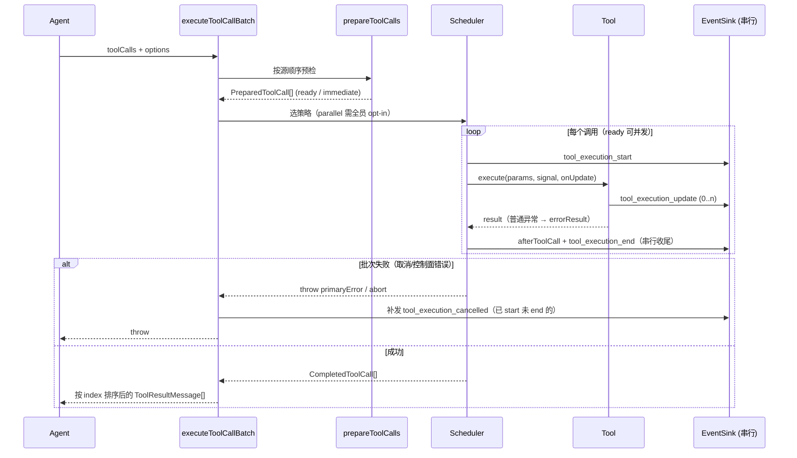

# tool-execution 模块代码讲解

> 路径：`packages/core/src/tool-execution/`
> 职责：接收模型在一次响应里给出的 **一批 Tool Call**，完成预检、调度执行、事件分发、结果组装，最终产出下一轮模型可见的 `ToolResultMessage[]`。

## 1. 文件职责总览

```text
tool-execution/
├── index.ts            # 对外门面：只导出 executeToolCallBatch 和配置类型
├── batch.ts            # 批次入口：预检 → 选策略 → 等待结算 → 按源顺序组装消息
├── prepare.ts          # 预检：把"能否执行"与"何时执行"分开（ready / immediate）
├── scheduler.ts        # 调度策略：串行兼容模式 / 受限并行调度器
├── execute-call.ts     # 单条调用的执行路径：executeReady / executeImmediate
├── event-dispatcher.ts # 工具事件的串行出口，区分控制面故障与业务错误
└── serial-queue.ts     # 通用串行队列（Promise 链），与工具语义无关
```

分层关系：

```text
executeToolCallBatch (batch.ts)
  prepareToolCalls            (prepare.ts)
  shouldExecuteInParallel     (scheduler.ts)
  executeSequential ──┐
  executeParallel ────┤
                      ▼
        executeReady / executeImmediate   (execute-call.ts)
          ├── ToolEventDispatcher ── SerialQueue   (事件串行出口)
          └── finalization: SerialQueue            (收尾串行队列)
```

---

## 2. 整体设计：两阶段 + 两条串行队列

这个模块的核心思想可以概括成三句话：

1. **先预检，后执行**：`prepareToolCalls` 严格按模型源顺序跑完整个批次的检查（工具存在？参数合法？被 Hook 阻止？），全部预检完才开始任何执行。这样 `beforeToolCall` Hook 看到的是"尚未产生任何副作用"的完整批次。
2. **并行归并行，串行归串行**：工具主体（`tool.execute`）可以并发跑，但**事件出口**和**收尾阶段**（`afterToolCall` + `tool_execution_end` 事件）各自只有一条串行队列，保证 EventSink 任意时刻只处理一个事件，维持 Agent 状态归约的串行契约。
3. **批次原子性**：`executeToolCallBatch` 成功返回前不修改 Transcript；失败批次给"已 start 未 end"的调用补发 `tool_execution_cancelled` 事件，让外部消费者看到的生命周期完整闭合。

---

## 3. 预检阶段（prepare.ts）

### 3.1 PreparedToolCall：两种命运的判别联合

```ts
export type PreparedToolCall =
  | { kind: "ready";      // 通过全部检查，等待真实执行
      index; toolCall; tool; parameters }
  | { kind: "immediate";  // 不用执行，直接合成一个错误结果
      index; toolCall; result };
```

- `ready`：工具存在、`tool.validate()` 通过、`beforeToolCall` 未阻止。
- `immediate`：未知工具 / 参数非法 / 被 Hook 阻止——不调用 `execute`，直接产生错误结果，但**仍会走完整的 start/end 事件生命周期**（见 §5.2），让 UI 看到的行为一致。

### 3.2 关键细节

- **ID 校验最先做**：`validateToolCallIds` 在任何 Hook 或工具启动前检查调用 ID 非空且不重复——这是模型协议的完整性检查，坏了直接抛错，整个批次不执行。
- **`index` 字段**：保存模型给出的原始顺序。并行执行会打乱完成顺序，批次结束后靠它排序还原（见 §7）。
- **`parameters` 是校验后的值**：`tool.validate()` 返回收窄后的强类型参数，执行阶段直接用，不再碰原始的 `toolCall.arguments`。

---

## 4. 串行基础设施（serial-queue.ts）

### 4.1 核心技巧：Promise 链即锁

```text
enqueue(op)
  result = tail.then(op)      ← 新任务永远接在 tail 后面
  tail   = result.then(吞掉成败) ← tail 只维护顺序，永不 rejected
  return result               ← 调用方拿到的是带成败的版本
```

任意时刻只有一个任务真正执行——"串行"不靠锁，靠这条 Promise 链。

### 4.2 为什么 tail 要吞掉错误

`tail = result.then(() => undefined, () => undefined)`：两个回调都返回 `undefined`，成功失败都吸收。否则某个任务失败后 `tail` 本身变成 rejected，后面排进来的**所有**任务链都会被跳过，队列就废了。

### 4.3 fail-stop 语义

第一个任务失败后，队列记住错误，之后 enqueue 的任务**不再执行 operation**，直接复用同一个失败。动机：Hook 或事件在批次已失效后不应继续改变共享状态。

---

## 5. 事件出口（event-dispatcher.ts）与错误分级

### 5.1 ToolEventDispatcher

包了一层 `SerialQueue` 的事件发射器。多个并行工具共享同一个出口，队列保证 EventSink 串行消费。

### 5.2 两类错误的严格区分

这是整个模块最重要的设计决策之一：

| 错误类型 | 例子 | 处理方式 |
|---|---|---|
| **控制面故障** | EventSink 抛错（`ToolEventDispatchError`）、用户取消（abort） | 向上抛给批次协调器，走取消/失败流程 |
| **业务错误** | 工具自身 `execute` 抛普通异常 | 降级为 `errorResult`，作为正常 Tool Result 反馈给模型 |

`ToolEventDispatchError` 这个专属错误类型就是区分的标记——下游用 `instanceof` 判断"事件通道坏了"还是"工具自己抛错"。

### 5.3 updateFailure：被吞掉的分发失败如何补抛

`executeReady` 中最难的一段（execute-call.ts:90-114）：

```text
onUpdate 是交给工具实现的回调，工具可以 try/catch 把它吞掉。
如果事件分发失败被吞：
  → 工具带着"残缺事件流"正常返回
  → 错误被包装成 Tool Result 喂给模型（把控制面故障当业务结果，错误！）

对策：
  update 回调里捕获分发失败 → 存进 updateFailure 变量 → 照样抛出
  execute 返回后检查 updateFailure → 补上这一抛
  catch 里：updateFailure 优先于一切其他错误（控制面 > 业务）
```

---

## 6. 单条调用的执行（execute-call.ts）

### 6.1 两条路径，共享一个 Finalization

```text
executeReady (kind=ready)
  emit tool_execution_start
  markStarted
  tool.execute(id, parameters, signal, onUpdate)   ← 唯一可能并发的部分
    └─ onUpdate → emit tool_execution_update（经串行事件通道）
  普通异常 → errorResult（降级为业务结果）
  finalizeCall ─────────────────────────────┐
                                            │
executeImmediate (kind=immediate)           │
  emit tool_execution_start                 │
  markStarted                               │
  finalizeCall(prepared.result) ────────────┤
                                            ▼
finalizeCall（在 finalization 串行队列里执行）
  afterToolCall Hook（可替换结果）
  emit tool_execution_end
  markTerminal
  返回 CompletedToolCall { index, toolCall, result }
```

### 6.2 为什么收尾要串行

`finalizeCall` 整体排在 `finalization: SerialQueue` 里执行。虽然工具主体可以并发结束，但 `afterToolCall` 和 terminal 事件必须串行——否则多个 Hook 同时改共享状态、事件乱序。

由此得到一个重要推论：**并发槽位直到 finalize 结束才释放**，所以 `maxConcurrency` 限制的是完整的 in-flight 调用生命周期，而不只是 `execute()` 的运行时间。

---

## 7. 调度策略（scheduler.ts）

### 7.1 策略选择：并行是显式 opt-in

```text
shouldExecuteInParallel(preparedCalls, mode) =
  mode === "parallel"
  且 每个 prepared 满足：
      kind === "immediate"           ← 错误不影响策略选择
      或 tool.executionMode === "parallel"
```

任何一个 ready 工具没声明 `parallel`，整个批次降级为串行。默认安全。

### 7.2 串行模式（executeSequential）

朴素的 for 循环：每个调用完成 Finalization 后才开始下一个。兼容旧语义。

### 7.3 受限并行调度器（executeParallel）

```text
对批次里每个 prepared（按源顺序）：
  immediate → record(executeImmediate(...), 不占槽位)
              await Promise.resolve()   ← 让出微任务，保证 start 事件按启动顺序入队
  ready     → while (activeReady.size >= maxConcurrency)
                await Promise.race(activeReady)   ← 等任意一个释放槽位，不要求按启动顺序
              record(executeReady(...), 占槽位)

最后：
  await Promise.allSettled(allStarted)   ← 等所有已启动工作 settle，不留孤儿任务
  if (hasPrimaryError) throw primaryError
  return completed
```

两个集合的分工：

- `activeReady: Set<Promise>`——只装占并发槽位的 ready 调用，用于限流。
- `allStarted: Promise[]`——还包含 immediate 调用，用于退出前等全部 settle。

### 7.4 record() 的两个技巧

1. **自引用的 tracked**：`let tracked!; tracked = promise.then(...).finally(() => activeReady.delete(tracked))`。`finally` 回调引用时 `tracked` 看似未赋值，但 `finally` 只在 settle 后运行，那时赋值早已完成——为了能在集合里精确删除"自己"。
2. **不在单任务里抛错**：单任务失败只记录第一个错误（primary error），由协调器在主循环末尾统一抛出。好处：(a) 不产生未处理 rejection；(b) 其他已启动任务不会变成孤儿（`Promise.allSettled` 会等它们）。

---

## 8. 批次入口（batch.ts）

```text
executeToolCallBatch(toolCalls, options)
  空批次 → 直接返回
  prepared = prepareToolCalls(...)            ← 预检（§3）
  events = new ToolEventDispatcher(options.emit)
  finalization = new SerialQueue()
  started / terminal 两个簿记结构 + markStarted / markTerminal

  try:
    completed = 并行? executeParallel : executeSequential
  catch:
    emitCancelledForOpenCalls()   ← 给"已 start 未 end"的调用补发 cancelled
    aborted 优先于错误：用户按了停止就报取消，不报错误
    throw

  completed.sort(by index)        ← 恢复模型源顺序
  return { messages: completed.map(toMessage) }   ← 转成 ToolResultMessage
```

### 8.1 取消时的生命周期闭合

`started`（Map）记录所有发过 start 事件的调用，`terminal`（Set）记录已发 end 的。批次失败时，差集就是"开了头没收尾"的调用，逐个补发 `tool_execution_cancelled`（reason: `"aborted"` 或 `"control_error"`）。外部消费者（UI / 状态归约）因此永远看到成对的 start/end 或 start/cancelled。

注意：若 EventSink 本身已失败（`events.failed`），就不再尝试补发——通道坏了发不出去，内部 pending 状态由 Agent 的 finally 清理。

### 8.2 依赖注入的边界

`ToolExecutionBatchOptions` 接收的是 **Agent 已规范化好的配置**（工具列表、模式、并发上限、Hook、EventSink、AbortSignal）。本模块只负责执行语义，不猜默认值、不读 Agent 的可变状态。

---

## 9. 一图总结：批次的完整生命周期



---

## 10. 设计要点速查

| 关注点 | 机制 |
|---|---|
| 协议完整性 | 预检最先校验调用 ID 非空、不重复 |
| Hook 决策依据 | 全部预检完成才开始执行，beforeToolCall 看到的是无副作用批次 |
| 并行安全性 | 并行显式 opt-in；事件出口与收尾各一条串行队列 |
| 错误分级 | `ToolEventDispatchError` / abort = 控制面（上抛）；工具异常 = 业务（降级为 errorResult） |
| 被吞的分发失败 | `updateFailure` 变量暂存，execute 返回后补抛，且优先级最高 |
| 限流粒度 | `maxConcurrency` 限制完整生命周期（含收尾），非仅 execute 时长 |
| 失败批次 | 补发 cancelled 事件闭合生命周期；primary error 统一抛出；不留孤儿任务 |
| 顺序保真 | `index` 记录源顺序，完成后排序还原 |
| 原子性 | 成功返回前不改 Transcript，失败批次不部分提交 |
